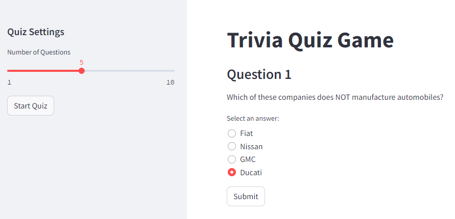

# Data Engineering Demo - Trivia App

This repository contains an application for a simple Trivia game.


Th rpoject examplifies a simple ETL process of fetching data from an API, transforming it and loading it to a database. The data is then utilized in a simple Trivia game, displayed in a Streamlit app.


# Installation

## To run the app (for Windows users):

2. Create a virtual environment:
    ```bash
    python -m venv venv
    ```

3. Activate the virtual environment:
    ```bash
    venv/Scripts/activate
    ```

4. Install the project requirements using `pip`:
    ```bash
    pip install -r requirements.txt
    ```

5.  ```bash
    streamlit run main.py
    ```
This will start the frontend server and the application can be accessed in the web browser at `http://localhost:8501`, or a different port specified by the user.
